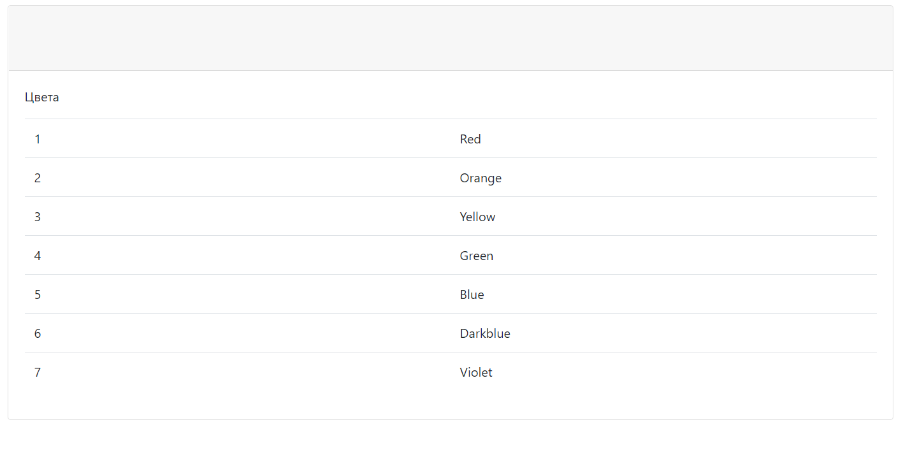
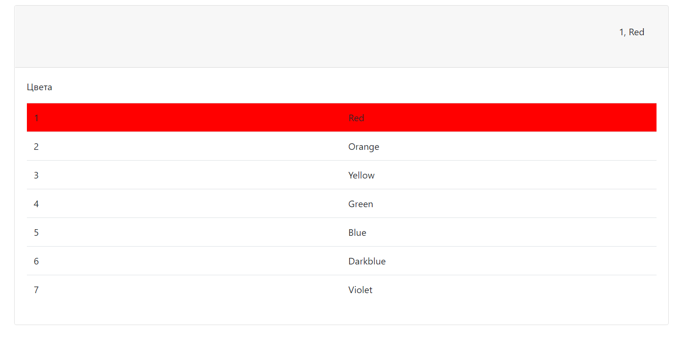
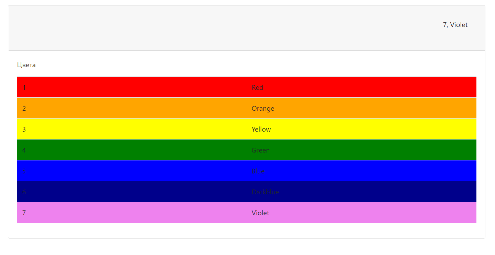

Тестовое задание 
Требуется создать таблицу в базе данных и реализовать ее вывод на jsp.  
На jsp странице при клике на ячейку с названием, цвета реализовать следующий функционал:
 - цвет всей строки должен поменяться на цвет указанный в названии ячейки;
 - сверху, над таблицей, в отдельном поле должна появиться надпись с информацией строки через запятую(в данном случае это будет порядковый номер и название цвета);
Необходимо также создать хранимую процедуру(принимающую и возвращающую строку) в базе данных. Реализовать метод(с помощью java и jdbс) с параметром String и возращаемым значением String. Данный метод должен вызывать ранее созданную хранимую процедуру.  
В данном случае этот метод принимает код цвета(в виде String) и возвращает наименование цвета соответствующее этому коду из базы данных. 
Используемый стек 
 - Java EE;
 - Tomcat;
 - maven;
 - Servlet;
 - JavaScript;
 - Postgresql;
 - JDBC;
 - CSS;
 - HTML;
 - JSP.
 
 
 Изначальное представление таблицы
 
 Произведен клик на ячеке с надписью Red
 
 Произведены клики по всем ячекам с названиями цветов